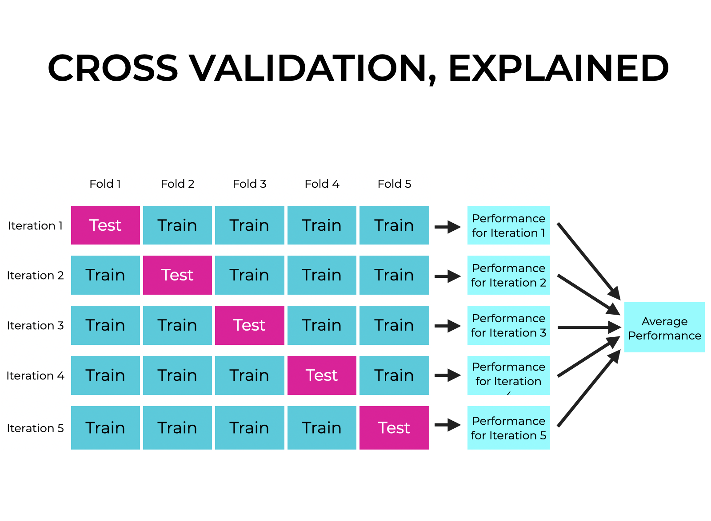

# Resumo: Mineração de Dados (P2)

- [Resumo: Mineração de Dados (P2)](#resumo-mineração-de-dados-p2)
  - [Parte 1: Avaliação de Desempenho de Modelos de Classificação](#parte-1-avaliação-de-desempenho-de-modelos-de-classificação)
    - [1. Métodos de Particionamento de Dados](#1-métodos-de-particionamento-de-dados)
      - [1.1. Método Holdout](#11-método-holdout)
      - [1.2. Validação Cruzada (_k-fold Cross-Validation_)](#12-validação-cruzada-k-fold-cross-validation)
    - [2. Matriz de Confusão](#2-matriz-de-confusão)
    - [3. Métricas de Classificação](#3-métricas-de-classificação)
      - [3.1. Acurácia (_Accuracy_)](#31-acurácia-accuracy)
      - [3.2. Sensibilidade, Recall ou Taxa de Verdadeiros Positivos (_Sensitivity / Recall / TPR_)](#32-sensibilidade-recall-ou-taxa-de-verdadeiros-positivos-sensitivity--recall--tpr)
      - [3.3. Precisão (_Precision_)](#33-precisão-precision)
      - [3.4. Especificidade (_Specificity / True Negative Rate_)](#34-especificidade-specificity--true-negative-rate)
      - [3.5. F1-Score (Medida-F)](#35-f1-score-medida-f)
  - [Parte 2: Regras de Associação](#parte-2-regras-de-associação)
    - [1. Introdução e Motivação](#1-introdução-e-motivação)
    - [2. Conceitos Fundamentais](#2-conceitos-fundamentais)
      - [2.1. Itens e Conjunto de Itens (_Itemset_)](#21-itens-e-conjunto-de-itens-itemset)
      - [2.2. Suporte (_Support_)](#22-suporte-support)
      - [2.3. Confiança (_Confidence_)](#23-confiança-confidence)
      - [2.4. Itemset Frequente (_Frequent Itemset_)](#24-itemset-frequente-frequent-itemset)
      - [2.5. Regra de Associação](#25-regra-de-associação)
    - [3. O Problema da Mineração de Regras de Associação](#3-o-problema-da-mineração-de-regras-de-associação)
    - [4. Propriedade Antimonótona do Suporte (_Apriori Property_)](#4-propriedade-antimonótona-do-suporte-apriori-property)
    - [5. Algoritmo Apriori](#5-algoritmo-apriori)
      - [5.1. Geração de Regras a partir de Itemsets Frequentes](#51-geração-de-regras-a-partir-de-itemsets-frequentes)
      - [5.2. Complexidade e Limitações do Apriori](#52-complexidade-e-limitações-do-apriori)
    - [6. Algoritmo FP-Growth (_Frequent Pattern Growth_)](#6-algoritmo-fp-growth-frequent-pattern-growth)
    - [7. Métricas de Interesse e Qualidade das Regras](#7-métricas-de-interesse-e-qualidade-das-regras)
      - [7.1. Lift (Elevação)](#71-lift-elevação)
      - [7.2. Leverage (Alavancagem)](#72-leverage-alavancagem)
      - [7.3. Convicção (_Conviction_)](#73-convicção-conviction)
      - [7.4. Tabela Comparativa das Métricas](#74-tabela-comparativa-das-métricas)
    - [8. Regras de Associação Multidimensionais](#8-regras-de-associação-multidimensionais)
    - [9. Regras de Associação com Restrições](#9-regras-de-associação-com-restrições)
    - [10. Pós-Processamento e Interpretação das Regras](#10-pós-processamento-e-interpretação-das-regras)
    - [11. Resumo Visual do Processo](#11-resumo-visual-do-processo)
    - [12. Exemplo Completo e Integrado](#12-exemplo-completo-e-integrado)
    - [13. Comparação: Regras de Associação vs. Classificação](#13-comparação-regras-de-associação-vs-classificação)
  - [Parte 3: K-Means](#parte-3-k-means)


## Parte 1: Avaliação de Desempenho de Modelos de Classificação

A fase de avaliação de desempenho é fundamental após a construção de um modelo de classificação (fase de treinamento). O modelo é aplicado em um **conjunto de testes** para prever os rótulos de classes de registros não vistos anteriormente. O principal objetivo é medir o desempenho do modelo em dados inéditos, fornecendo uma estimativa imparcial do seu erro e de sua capacidade de generalização.

---

### 1. Métodos de Particionamento de Dados

#### 1.1. Método Holdout

> **Holdout** é um método de avaliação que divide o conjunto de dados original em dois subconjuntos independentes e mutuamente exclusivos: um para **treinamento** e outro para **teste**.

Geralmente, adota-se uma proporção de divisão como **50/50**, **70/30** (dois terços para treino e um terço para teste) ou **80/20**.

**Funcionamento:**

1. **Conjunto de Treinamento:** Usado para induzir e treinar o modelo.
2. **Conjunto de Testes:** Usado exclusivamente para avaliar o desempenho do modelo em registros nunca vistos.

**Exemplo:** Em uma base de dados com 1.000 registros e divisão 70/30, 700 registros são usados para treinar o classificador, e 300 são usados para medir seu desempenho real.

**Limitações:**

- **Poucos exemplos de treinamento:** Se o conjunto de treinamento for muito pequeno, o modelo não alcançará um bom desempenho, diferentemente de um com mais exemplos de treino.
- **Alta variância dependente da divisão:** O modelo pode ser instável dependendo de como os conjuntos foram divididos. Quanto menor o conjunto de treinamento, maior a variância estimada do erro.
- **Desbalanceamento não intencional:** Como os subconjuntos são extraídos aleatoriamente, uma classe pode ficar super-representada no treino e sub-representada no teste (e vice-versa). Para mitigar isso, recomenda-se a **Amostragem Estratificada**, que garante que as proporções das classes sejam mantidas em ambas as partições.

---

#### 1.2. Validação Cruzada (_k-fold Cross-Validation_)

> **Validação Cruzada k-fold** é um método de avaliação em que o conjunto de dados é particionado em $k$ subconjuntos (folds) de tamanhos iguais. O modelo é treinado e avaliado $k$ vezes, usando rotacionalmente cada fold como conjunto de teste.

**Funcionamento:**

- O conjunto de dados original é dividido em $k$ subconjuntos $D_1, D_2, \dots, D_k$ de tamanhos iguais.
- Em cada iteração $i$ (onde $i = 1, \dots, k$), o fold $D_i$ é reservado como **conjunto de teste**, enquanto as $k-1$ partições restantes formam o **conjunto de treinamento**.
- Esse processo é repetido $k$ vezes, de modo que cada fold seja usado exatamente **uma vez** como conjunto de teste.

**Avaliação:**

- O erro total é calculado como a soma dos erros de todas as $k$ execuções.
- A estimativa final do desempenho do modelo é a **média** das estimativas das $k$ iterações.
- Pode-se também calcular a acurácia global diretamente:

$$\text{Acurácia global} = \frac{\text{Nº total de tuplas corretamente classificadas nas } k \text{ iterações}}{\text{Total geral de tuplas no conjunto de dados}}$$

**Exemplo:** Com $k = 10$ e 1.000 registros, cada fold terá 100 registros. Em cada rodada, 900 são usados para treino e 100 para teste. A acurácia final é a média das 10 acurácias obtidas.

**Vantagem sobre o Holdout:** Todos os exemplos são usados tanto para treino quanto para teste, reduzindo a variância da estimativa de desempenho.



---

### 2. Matriz de Confusão

> A **Matriz de Confusão** é uma tabela que confronta as classes reais dos exemplos com as classes preditas pelo modelo, permitindo visualizar de forma estruturada os tipos de erros e acertos cometidos pelo classificador.

Para classificação **binária** (dois rótulos: Positivo e Negativo), a matriz tem a seguinte estrutura:

|                    | **Previsto: Positivo**   | **Previsto: Negativo**   |
| ------------------ | ------------------------ | ------------------------ |
| **Real: Positivo** | Verdadeiro Positivo (VP) | Falso Negativo (FN)      |
| **Real: Negativo** | Falso Positivo (FP)      | Verdadeiro Negativo (VN) |

**Interpretação de cada célula:**

- **VP (Verdadeiro Positivo):** O modelo previu **positivo** e o real era **positivo** → acerto.
- **VN (Verdadeiro Negativo):** O modelo previu **negativo** e o real era **negativo** → acerto.
- **FP (Falso Positivo):** O modelo previu **positivo**, mas o real era **negativo** → **Erro Tipo I** (alarme falso).
- **FN (Falso Negativo):** O modelo previu **negativo**, mas o real era **positivo** → **Erro Tipo II** (falha em detectar).

**Exemplo prático:** Um classificador de doenças avalia 200 pacientes.

|                    | **Previsto: Doente** | **Previsto: Saudável** |
| ------------------ | -------------------- | ---------------------- |
| **Real: Doente**   | VP = 80              | FN = 20                |
| **Real: Saudável** | FP = 10              | VN = 90                |

O modelo acertou 80 + 90 = 170 casos e errou 20 + 10 = 30.

---

### 3. Métricas de Classificação

As métricas a seguir utilizam os valores da matriz de confusão para avaliar o classificador sob diferentes perspectivas. Cada métrica captura um aspecto distinto de qualidade.

#### 3.1. Acurácia (_Accuracy_)

> **Acurácia** mede a proporção de predições corretas (tanto positivas quanto negativas) em relação ao total de exemplos avaliados.

$$\text{Acurácia} = \frac{VP + VN}{VP + VN + FP + FN}$$

**Quando usar:** Adequada quando as classes são **balanceadas** (número semelhante de exemplos em cada classe).

**Limitação:** Em bases desbalanceadas, a acurácia pode ser enganosa. Um modelo que sempre prevê a classe majoritária pode ter alta acurácia, mas ser inútil.

**Exemplo:** Com VP=80, VN=90, FP=10, FN=20: $\text{Acurácia} = \frac{80 + 90}{200} = \frac{170}{200} = 0{,}85 = 85\%$

---

#### 3.2. Sensibilidade, Recall ou Taxa de Verdadeiros Positivos (_Sensitivity / Recall / TPR_)

> **Sensibilidade** mede, dentre todos os exemplos **realmente positivos**, qual fração o modelo conseguiu detectar corretamente.

$$\text{Sensibilidade} = \frac{VP}{VP + FN}$$

**Quando usar:** Crítica em contextos onde **deixar de detectar um positivo é muito custoso** — como doenças graves, fraudes financeiras ou falhas em sistemas críticos.

**Exemplo:** Com VP=80 e FN=20: $\text{Sensibilidade} = \frac{80}{80 + 20} = \frac{80}{100} = 0{,}80 = 80\%$.
O modelo detectou 80% dos pacientes doentes.

---

#### 3.3. Precisão (_Precision_)

> **Precisão** mede, dentre todos os exemplos que o modelo **previu como positivos**, qual fração realmente era positiva.

$$\text{Precisão} = \frac{VP}{VP + FP}$$

**Quando usar:** Crítica em contextos onde **gerar falsos alarmes é muito custoso** — como filtros de spam (não queremos bloquear e-mails legítimos) ou diagnósticos invasivos.

**Exemplo:** Com VP=80 e FP=10: $\text{Precisão} = \frac{80}{80 + 10} = \frac{80}{90} \approx 0{,}889 = 88{,}9\%$.
Dos pacientes classificados como doentes, 88,9% de fato eram.

---

#### 3.4. Especificidade (_Specificity / True Negative Rate_)

> **Especificidade** mede, dentre todos os exemplos **realmente negativos**, qual fração o modelo identificou corretamente como negativos.

$$\text{Especificidade} = \frac{VN}{VN + FP}$$

**Quando usar:** Complementar à Sensibilidade. Alta especificidade significa que o modelo raramente comete Falsos Positivos — importante quando o custo de tratar um saudável como doente é alto.

**Exemplo:** Com VN=90 e FP=10: $\text{Especificidade} = \frac{90}{90 + 10} = \frac{90}{100} = 0{,}90 = 90\%$.
O modelo identificou corretamente 90% dos pacientes saudáveis como saudáveis.

---

#### 3.5. F1-Score (Medida-F)

> O **F1-Score** é a **média harmônica** entre Precisão e Sensibilidade. Ele fornece um indicador equilibrado de desempenho, especialmente valioso em bases de dados **desbalanceadas**, pois penaliza modelos que se saem bem em apenas uma das duas métricas.

$$F_1 = 2 \times \frac{\text{Precisão} \times \text{Sensibilidade}}{\text{Precisão} + \text{Sensibilidade}}$$

**Por que média harmônica?** A média harmônica é mais conservadora que a média aritmética: ela é puxada para baixo pelo menor dos dois valores. Um modelo com Precisão=1,0 e Sensibilidade=0,1 teria F1=0,18, não 0,55 (que seria a média aritmética).

**Exemplo:** Com Precisão≈0,889 e Sensibilidade=0,80:

$$F_1 = 2 \times \frac{0{,}889 \times 0{,}80}{0{,}889 + 0{,}80} = 2 \times \frac{0{,}711}{1{,}689} \approx 0{,}842 = 84{,}2\%$$

**Variação — Fβ-Score:** Permite dar mais peso a uma das métricas:

$$F_\beta = (1 + \beta^2) \times \frac{\text{Precisão} \times \text{Sensibilidade}}{\beta^2 \times \text{Precisão} + \text{Sensibilidade}}$$

- $\beta = 1$: peso igual (F1-Score padrão)
- $\beta = 2$: maior peso para Sensibilidade (prioriza encontrar positivos)
- $\beta = 0{,}5$: maior peso para Precisão (prioriza evitar falsos alarmes)

---

## Parte 2: Regras de Associação

### 1. Introdução e Motivação

> **Regras de Associação** são padrões do tipo **"SE condição ENTÃO consequência"** extraídos de grandes conjuntos de dados transacionais, expressando relações de co-ocorrência frequente entre itens ou atributos.

As regras de associação pertencem à categoria de tarefas **descritivas** da mineração de dados. Seu objetivo é descobrir automaticamente quais itens tendem a aparecer **juntos** nas transações, sem que haja uma variável alvo pré-definida — diferentemente da classificação.

**Problema central — Análise de Cesta de Mercado (_Market Basket Analysis_):**

Imagine um supermercado com milhares de transações diárias. Cada compra é um conjunto de produtos. O objetivo é descobrir padrões de compra conjunto, como:

> _"Clientes que compram **fraldas** tendem a comprar **cerveja** na mesma visita."_

Esse conhecimento pode guiar decisões de layout de loja, promoções cruzadas e recomendações automáticas em e-commerce.

**Outros domínios de aplicação:**

| Domínio              | Exemplo de Regra                                       |
| -------------------- | ------------------------------------------------------ |
| Varejo               | {Pão, Manteiga} → {Leite}                              |
| Medicina             | {Febre, Tosse Seca} → {Covid-19}                       |
| Web                  | {Usuário visita Página A, B} → {Visita Página C}       |
| Sistemas de Arquivos | {Arquivo X acessado} → {Arquivo Y acessado em seguida} |
| Telecomunicações     | {Plano X, Recurso A} → {Cancela serviço em 3 meses}    |
| Educação             | {Reprova em Cálculo I} → {Reprova em Física I}         |

---

### 2. Conceitos Fundamentais

#### 2.1. Itens e Conjunto de Itens (_Itemset_)

> Um **item** é um elemento atômico de dado (ex.: um produto). Um **itemset** (conjunto de itens) é qualquer subconjunto não vazio de itens. Um itemset com $k$ elementos é chamado de **$k$-itemset**.

**Notação:**

- $I = \{i_1, i_2, \dots, i_m\}$: o conjunto de todos os itens disponíveis.
- $T = \{t_1, t_2, \dots, t_n\}$: o banco de dados de transações.
- Cada transação $t_j \subseteq I$ é um subset de itens.

**Exemplo:**

| TID  | Itens Comprados              |
| ---- | ---------------------------- |
| T001 | Leite, Pão, Manteiga         |
| T002 | Cerveja, Fraldas             |
| T003 | Leite, Fraldas, Cerveja, Pão |
| T004 | Leite, Pão                   |
| T005 | Fraldas, Cerveja, Manteiga   |

Aqui, $I = \{\text{Leite, Pão, Manteiga, Cerveja, Fraldas}\}$ e há 5 transações.

---

#### 2.2. Suporte (_Support_)

> O **suporte** de um itemset $X$ mede com que **frequência** ele aparece no conjunto de transações. É a proporção de transações que contêm $X$.

$$\text{Suporte}(X) = \frac{|\{t \in T \mid X \subseteq t\}|}{|T|}$$

Ou seja, é o número de transações que contêm $X$ dividido pelo total de transações.

**Para uma regra** $X \Rightarrow Y$, o suporte mede a frequência com que **ambos** $X$ e $Y$ aparecem juntos:

$$\text{Suporte}(X \Rightarrow Y) = \text{Suporte}(X \cup Y) = \frac{|\{t \in T \mid X \cup Y \subseteq t\}|}{|T|}$$

**Exemplo:** No banco de dados acima:

- {Leite} aparece em T001, T003, T004 → $\text{Suporte(Leite)} = 3/5 = 0{,}60$
- {Cerveja, Fraldas} aparece em T002, T003, T005 → $\text{Suporte(Cerveja, Fraldas)} = 3/5 = 0{,}60$
- {Leite, Pão} aparece em T001, T003, T004 → $\text{Suporte(Leite, Pão)} = 3/5 = 0{,}60$

O suporte garante que a regra seja **estatisticamente relevante** (ocorre com frequência suficiente).

---

#### 2.3. Confiança (_Confidence_)

> A **confiança** de uma regra $X \Rightarrow Y$ mede a **probabilidade** de que, dado que a transação contém $X$, ela também contenha $Y$. Equivale à precisão direcional da regra.

$$\text{Confiança}(X \Rightarrow Y) = \frac{\text{Suporte}(X \cup Y)}{\text{Suporte}(X)} = P(Y \mid X)$$

**Exemplo:**

- $\text{Suporte(Fraldas, Cerveja)} = 3/5 = 0{,}60$
- $\text{Suporte(Fraldas)} = 3/5 = 0{,}60$ (aparece em T002, T003, T005)
- $\text{Confiança(Fraldas} \Rightarrow \text{Cerveja)} = 0{,}60 / 0{,}60 = 1{,}00 = 100\%$

Toda vez que Fraldas aparece, Cerveja também aparece. A confiança garante que a regra seja **confiável** — não apenas frequente.

> **Atenção:** a confiança não é simétrica. $\text{Confiança}(X \Rightarrow Y) \neq \text{Confiança}(Y \Rightarrow X)$ em geral.

---

#### 2.4. Itemset Frequente (_Frequent Itemset_)

> Um itemset $X$ é chamado **frequente** se o seu suporte for maior ou igual a um limiar mínimo pré-definido, denominado **suporte mínimo** ($\text{minsup}$).

$$\text{Suporte}(X) \geq \text{minsup}$$

**Exemplo:** Com minsup = 0,60 (60%):

- {Leite} → Suporte = 0,60 ✅ frequente
- {Cerveja, Fraldas} → Suporte = 0,60 ✅ frequente
- {Manteiga} → Suporte = 2/5 = 0,40 ❌ não frequente

---

#### 2.5. Regra de Associação

> Uma **regra de associação** é uma expressão da forma $X \Rightarrow Y$, onde $X$ e $Y$ são itemsets disjuntos ($X \cap Y = \emptyset$). $X$ é chamado de **antecedente** (ou lado esquerdo, LHS) e $Y$ de **consequente** (ou lado direito, RHS).

Uma regra $X \Rightarrow Y$ é considerada **interessante** se atende simultaneamente a dois critérios:

1. $\text{Suporte}(X \cup Y) \geq \text{minsup}$ — é frequente o suficiente.
2. $\text{Confiança}(X \Rightarrow Y) \geq \text{minconf}$ — é confiável o suficiente.

**Exemplos de regras:**

- {Fraldas} → {Cerveja}: suporte=60%, confiança=100%
- {Leite, Pão} → {Manteiga}: suporte=20%, confiança=33%
- {Pão} → {Leite}: calculado a seguir...

---

### 3. O Problema da Mineração de Regras de Associação

O desafio computacional é imenso: para $m$ itens distintos, existem $2^m - 1$ itemsets possíveis não vazios. Com apenas 100 itens distintos, isso gera mais de $10^{30}$ combinações — tornando a busca exaustiva impossível.

**A solução:** Algoritmos inteligentes que exploram propriedades matemáticas para **podar** o espaço de busca. O mais clássico é o **Algoritmo Apriori**.

**Divisão do problema em duas etapas:**

1. **Geração de Itemsets Frequentes:** Encontrar todos os itemsets cujo suporte $\geq$ minsup.
2. **Geração de Regras de Associação:** A partir dos itemsets frequentes, gerar regras com confiança $\geq$ minconf.

---

### 4. Propriedade Antimonótona do Suporte (_Apriori Property_)

> **Propriedade Antimonótona (Apriori):** Se um itemset $X$ é **frequente**, então todo subconjunto de $X$ também é frequente. Equivalentemente, se um itemset $X$ é **infrequente**, então todo superconjunto de $X$ também é infrequente.

**Formalmente:**

$$\forall Y \subseteq X: \text{Suporte}(X) \leq \text{Suporte}(Y)$$

**Intuição:** Se {A, B, C} aparece em 30% das transações, então {A, B} deve aparecer em pelo menos 30% (já que sempre que {A, B, C} aparece, {A, B} também aparece). O contrário também vale: se {A} não é frequente, qualquer itemset que contenha A também não será frequente.

**Por que isso é poderoso?** Permite **poda em largura primeiro**: ao identificar que um itemset de tamanho $k$ é infrequente, todos os seus superconjuntos (de tamanho $k+1, k+2, \dots$) podem ser eliminados do espaço de busca sem precisar calculá-los.

```
Exemplo de poda:
- {Manteiga} é infrequente (suporte=40% < minsup=60%)
→ {Leite, Manteiga}, {Pão, Manteiga}, {Cerveja, Manteiga}, ... → todos eliminados
```

---

### 5. Algoritmo Apriori

> O **Algoritmo Apriori** é o método clássico de mineração de itemsets frequentes. Ele faz múltiplas varreduras do banco de dados, gerando candidatos de tamanho crescente e podando infrequentes a cada passo.

**Pseudocódigo:**

```
Apriori(Transações T, minsup):
  L1 = {1-itemsets frequentes}
  k = 2
  enquanto Lk-1 não for vazio:
    Ck = AprioriGen(Lk-1)         // Gera candidatos de tamanho k
    Para cada transação t em T:
      Ct = subset(Ck, t)          // Candidatos contidos em t
      Para cada candidato c em Ct:
        c.count++
    Lk = {c ∈ Ck | c.count/|T| ≥ minsup}
    k++
  retornar UNION de todos Lk
```

**Funcionamento passo a passo com o exemplo:**

**Base de dados:**

| TID  | Itens                        |
| ---- | ---------------------------- |
| T001 | Leite, Pão, Manteiga         |
| T002 | Cerveja, Fraldas             |
| T003 | Leite, Fraldas, Cerveja, Pão |
| T004 | Leite, Pão                   |
| T005 | Fraldas, Cerveja, Manteiga   |

**minsup = 60% (3 de 5 transações)**

**Passo 1: Gerar C1 (1-itemsets candidatos) e contar:**

| Itemset    | Contagem | Suporte | Frequente? |
| ---------- | -------- | ------- | ---------- |
| {Leite}    | 3        | 60%     | ✅         |
| {Pão}      | 3        | 60%     | ✅         |
| {Manteiga} | 2        | 40%     | ❌         |
| {Cerveja}  | 3        | 60%     | ✅         |
| {Fraldas}  | 3        | 60%     | ✅         |

→ $L_1 = \{\{Leite\}, \{Pão\}, \{Cerveja\}, \{Fraldas\}\}$

**Passo 2: Gerar C2 a partir de L1 (pares de itens frequentes) e contar:**

| Itemset            | Contagem | Suporte | Frequente? |
| ------------------ | -------- | ------- | ---------- |
| {Leite, Pão}       | 3        | 60%     | ✅         |
| {Leite, Cerveja}   | 1        | 20%     | ❌         |
| {Leite, Fraldas}   | 1        | 20%     | ❌         |
| {Pão, Cerveja}     | 1        | 20%     | ❌         |
| {Pão, Fraldas}     | 1        | 20%     | ❌         |
| {Cerveja, Fraldas} | 3        | 60%     | ✅         |

→ $L_2 = \{\{Leite, Pão\}, \{Cerveja, Fraldas\}\}$

> Manteiga já foi podada no Passo 1, então não entra em C2.

**Passo 3: Gerar C3 a partir de L2:**

Para gerar 3-itemsets, precisamos combinar 2-itemsets que compartilhem k-1 itens em comum. {Leite, Pão} e {Cerveja, Fraldas} não compartilham nenhum item → $C_3 = \emptyset$ → algoritmo encerra.

**Resultado:** Itemsets frequentes = {Leite}, {Pão}, {Cerveja}, {Fraldas}, {Leite, Pão}, {Cerveja, Fraldas}.

#### 5.1. Geração de Regras a partir de Itemsets Frequentes

Para cada itemset frequente $L$, geramos todas as regras $X \Rightarrow (L - X)$ para todo subconjunto não vazio $X \subset L$, e filtramos pelas que atingem minconf.

**Exemplo com {Leite, Pão} (suporte = 60%):**

| Regra           | Cálculo                                             | Confiança |
| --------------- | --------------------------------------------------- | --------- |
| {Leite} → {Pão} | suporte({Leite,Pão}) / suporte({Leite}) = 0,60/0,60 | 100%      |
| {Pão} → {Leite} | suporte({Leite,Pão}) / suporte({Pão}) = 0,60/0,60   | 100%      |

**Exemplo com {Cerveja, Fraldas} (suporte = 60%):**

| Regra                 | Cálculo            | Confiança |
| --------------------- | ------------------ | --------- |
| {Fraldas} → {Cerveja} | 0,60 / 0,60 = 1,00 | 100%      |
| {Cerveja} → {Fraldas} | 0,60 / 0,60 = 1,00 | 100%      |

Com **minconf = 80%**, ambas as regras de cada itemset são aceitas.

#### 5.2. Complexidade e Limitações do Apriori

**Complexidade:**

- Realiza até $k_{\max}$ varreduras completas do banco de dados (onde $k_{\max}$ é o tamanho do maior itemset frequente).
- Pode gerar um número enorme de candidatos em C2.

**Limitações:**

- **Alto custo de I/O:** Cada passagem pelo banco de dados é cara quando os dados são grandes.
- **Grande número de candidatos:** Com minsup baixo, $C_2$ pode ter milhões de candidatos.
- **Banco de dados em memória RAM:** O banco precisa caber em memória para ser eficiente.

---

### 6. Algoritmo FP-Growth (_Frequent Pattern Growth_)

> O **FP-Growth** é uma alternativa ao Apriori mais eficiente. Ao invés de gerar candidatos explicitamente, ele **comprime o banco de dados em uma estrutura de árvore** (FP-Tree) e minera os itemsets frequentes diretamente dessa estrutura, sem múltiplas varreduras do BD.

**Vantagens sobre o Apriori:**

- Apenas **2 varreduras** do banco de dados (uma para contar suportes individuais, outra para construir a árvore).
- Não gera candidatos explícitos.
- Muito mais eficiente para bases densas e com minsup baixo.

**Estrutura FP-Tree:**

A FP-Tree é uma árvore de prefixos comprimida. Cada nó representa um item e armazena sua contagem. Caminhos compartilhados por transações são fundidos.

**Construção passo a passo (com o exemplo, minsup=60%):**

1. **1ª Varredura:** Conta suportes de 1-itemsets e filtra infrequentes. Ordena os itens por frequência decrescente.

   Ordem por frequência: Leite(3), Pão(3), Cerveja(3), Fraldas(3) → todos empate, ordenação alfabética ou arbitrária.

2. **2ª Varredura:** Para cada transação, insere os itens (já filtrados e ordenados) na árvore.

   ```
        root
       /    \
    Leite(3)  Cerveja(2)
      |          |
    Pão(3)   Fraldas(2)
              |
           Fraldas(1)
   ```

   _(Representação simplificada)_

3. **Mineração:** O algoritmo minera a FP-Tree usando o conceito de **base de padrões condicionais** — reconstruindo sub-árvores condicionadas a cada item e minerando recursivamente.

---

### 7. Métricas de Interesse e Qualidade das Regras

Apenas suporte e confiança podem não ser suficientes para garantir regras realmente **úteis e não óbvias**. Outras métricas ajudam a filtrar regras triviais ou enganosas.

#### 7.1. Lift (Elevação)

> O **Lift** mede o quanto a presença de $X$ **aumenta** (ou diminui) a probabilidade de ocorrência de $Y$, em comparação com a ocorrência independente de $Y$.

$$\text{Lift}(X \Rightarrow Y) = \frac{\text{Confiança}(X \Rightarrow Y)}{\text{Suporte}(Y)} = \frac{\text{Suporte}(X \cup Y)}{\text{Suporte}(X) \times \text{Suporte}(Y)}$$

**Interpretação:**

- $\text{Lift} > 1$: $X$ e $Y$ são **positivamente correlacionados** — ocorrem juntos mais do que o esperado por acaso. A regra é genuinamente interessante.
- $\text{Lift} = 1$: $X$ e $Y$ são **independentes** — a presença de $X$ não afeta a probabilidade de $Y$. Regra inútil.
- $\text{Lift} < 1$: $X$ e $Y$ são **negativamente correlacionados** — a presença de $X$ reduz a probabilidade de $Y$.

**Exemplo:**

- {Fraldas} → {Cerveja}: Confiança=100%, Suporte(Cerveja)=60%

$$\text{Lift} = \frac{1{,}00}{0{,}60} \approx 1{,}67$$

O Lift > 1 confirma que a regra é genuinamente interessante: comprar fraldas aumenta a chance de comprar cerveja em 67% além do que se esperaria aleatoriamente.

---

#### 7.2. Leverage (Alavancagem)

> O **Leverage** mede a **diferença absoluta** entre a frequência observada da co-ocorrência de $X$ e $Y$ e a frequência esperada se fossem independentes.

$$\text{Leverage}(X \Rightarrow Y) = \text{Suporte}(X \cup Y) - \text{Suporte}(X) \times \text{Suporte}(Y)$$

**Interpretação:**

- $\text{Leverage} > 0$: maior co-ocorrência do que esperado → correlação positiva.
- $\text{Leverage} = 0$: independência.
- $\text{Leverage} < 0$: menor co-ocorrência do que esperado → correlação negativa.

**Exemplo:**
$$\text{Leverage(Fraldas} \Rightarrow \text{Cerveja)} = 0{,}60 - (0{,}60 \times 0{,}60) = 0{,}60 - 0{,}36 = 0{,}24$$

---

#### 7.3. Convicção (_Conviction_)

> A **Convicção** mede o quanto a regra seria diferente se $X$ e $Y$ fossem independentes. Valores altos indicam forte dependência direcional.

$$\text{Conviction}(X \Rightarrow Y) = \frac{1 - \text{Suporte}(Y)}{1 - \text{Confiança}(X \Rightarrow Y)}$$

- Conviction → ∞ quando a Confiança → 1 (regra perfeita).
- Conviction = 1 quando X e Y são independentes.
- Vantagem sobre o Lift: é direcional.

**Exemplo:**
$$\text{Conviction(Fraldas} \Rightarrow \text{Cerveja)} = \frac{1 - 0{,}60}{1 - 1{,}00} = \frac{0{,}40}{0} \rightarrow \infty$$

A convicção infinita reflete que a regra é perfeita (confiança = 100%).

---

#### 7.4. Tabela Comparativa das Métricas

| Métrica    | Fórmula                               | Intervalo | Independência | Boa Regra |
| ---------- | ------------------------------------- | --------- | ------------- | --------- |
| Suporte    | $P(X \cup Y)$                         | [0, 1]    | —             | Alto      |
| Confiança  | $P(Y \mid X)$                         | [0, 1]    | = P(Y)        | Alto      |
| Lift       | $\frac{P(X \cup Y)}{P(X) \cdot P(Y)}$ | [0, ∞)    | = 1           | > 1       |
| Leverage   | $P(X \cup Y) - P(X) \cdot P(Y)$       | (-1, 1)   | = 0           | > 0       |
| Conviction | $\frac{1 - P(Y)}{1 - P(Y \mid X)}$    | [0, ∞)    | = 1           | Alto      |

---

### 8. Regras de Associação Multidimensionais

> **Regras de Associação Unidimensionais** envolvem apenas um tipo de atributo (ex.: produto comprado). **Regras Multidimensionais** envolvem dois ou mais atributos distintos.

**Exemplos:**

- Unidimensional: {Leite, Pão} → {Manteiga} (1 dimensão: produto)
- Multidimensional: {Idade: 25-35, Renda: Alta} → {Produto: Notebook} (3 dimensões)
- Híbrida: {Gênero: Masculino, Produto: Fraldas} → {Produto: Cerveja}

As regras multidimensionais são mais ricas em contexto, mas exigem técnicas adicionais de pré-processamento, como discretização de atributos contínuos.

---

### 9. Regras de Associação com Restrições

Na prática, nem sempre queremos **todas** as regras frequentes — isso pode gerar milhares de regras pouco úteis. Restrições permitem guiar a mineração para padrões específicos.

**Tipos de restrições:**

| Tipo                 | Descrição                                  | Exemplo                                         |
| -------------------- | ------------------------------------------ | ----------------------------------------------- |
| Restrição de Suporte | Filtrar por suporte mínimo mais alto       | Apenas regras com suporte ≥ 50%                 |
| Restrição de Tamanho | Limitar tamanho do antecedente/consequente | Regras com no máximo 3 itens                    |
| Restrição de Item    | Exigir ou proibir itens específicos        | Consequente deve ser {Cerveja}                  |
| Restrição de Domínio | Filtrar por atributos do domínio           | Apenas produtos da categoria "Bebidas"          |
| Restrição Agregada   | Restrições sobre funções agregadas         | Soma dos preços dos itens do antecedente > R$50 |

---

### 10. Pós-Processamento e Interpretação das Regras

Mesmo após a filtragem por suporte e confiança, um conjunto de regras pode ser **muito grande** (centenas ou milhares de regras). O pós-processamento é essencial.

**Técnicas de pós-processamento:**

1. **Filtragem por Lift:** Eliminar regras com Lift ≤ 1 (relações espúrias).
2. **Eliminação de Redundâncias:** Remover regras que são casos particulares de regras mais gerais com mesma ou melhor qualidade.
3. **Agrupamento de Regras:** Organizar regras por tema ou categoria.
4. **Visualização:** Grafos de associação, heatmaps de confiança vs. suporte.
5. **Validação por Especialistas do Domínio:** Especialistas avaliando se as regras fazem sentido prático.

**Regras triviais e enganosas:**

Uma regra pode ter alto suporte e alta confiança, mas ser completamente trivial ou até enganosa:

- **Trivial:** {Pão} → {Leite} pode ter confiança=90%, mas ambos são itens muito frequentes. O Lift pode ser próximo de 1, indicando que a compra de pão não influencia a de leite.
- **Enganosa (Simpson's Paradox):** Uma regra válida globalmente pode ser inválida quando os dados são segmentados por subgrupo.

---

### 11. Resumo Visual do Processo

```
Banco de Dados de Transações
          |
          ▼
[Definir minsup e minconf]
          |
          ▼
[Algoritmo Apriori / FP-Growth]
          |
          ▼
[Itemsets Frequentes]
          |
          ▼
[Geração de Regras de Associação]
          |
          ▼
[Filtragem por minconf]
          |
          ▼
[Pós-processamento: Lift, Leverage, Redundância]
          |
          ▼
[Regras Interessantes e Acionáveis]
```

---

### 12. Exemplo Completo e Integrado

**Cenário:** Uma farmácia quer descobrir quais medicamentos/produtos são frequentemente comprados juntos para otimizar o layout e criar promoções.

**Base de Dados (minsup = 50%, minconf = 70%):**

| TID | Produtos                                  |
| --- | ----------------------------------------- |
| T01 | Dipirona, Buscopan, Soro Fisiológico      |
| T02 | Dipirona, Paracetamol                     |
| T03 | Paracetamol, Vitamina C, Soro Fisiológico |
| T04 | Dipirona, Buscopan                        |
| T05 | Dipirona, Paracetamol, Vitamina C         |
| T06 | Buscopan, Vitamina C                      |

**Passo 1 — Suportes dos 1-itemsets:**

| Item             | Contagem | Suporte   |
| ---------------- | -------- | --------- |
| Dipirona         | 4        | 4/6 ≈ 67% |
| Buscopan         | 3        | 3/6 = 50% |
| Soro Fisiológico | 2        | 2/6 ≈ 33% |
| Paracetamol      | 3        | 3/6 = 50% |
| Vitamina C       | 3        | 3/6 = 50% |

→ Frequentes (≥50%): {Dipirona}, {Buscopan}, {Paracetamol}, {Vitamina C}
→ {Soro Fisiológico} é podado (33% < 50%)

**Passo 2 — Suportes dos 2-itemsets (entre os frequentes):**

| Itemset                   | Contagem | Suporte   |
| ------------------------- | -------- | --------- |
| {Dipirona, Buscopan}      | 2        | 2/6 ≈ 33% |
| {Dipirona, Paracetamol}   | 2        | 2/6 ≈ 33% |
| {Dipirona, Vitamina C}    | 1        | 1/6 ≈ 17% |
| {Buscopan, Paracetamol}   | 0        | 0%        |
| {Buscopan, Vitamina C}    | 1        | 1/6 ≈ 17% |
| {Paracetamol, Vitamina C} | 2        | 2/6 ≈ 33% |

→ Nenhum 2-itemset atinge 50% → $L_2 = \emptyset$ _(exemplo demonstrativo com minsup=33% para continuar)_

**Gerando regras de {Dipirona, Paracetamol} (suporte=33%):**

| Regra                      | Confiança                                          |
| -------------------------- | -------------------------------------------------- |
| {Dipirona} → {Paracetamol} | suporte(Dip,Para)/suporte(Dip) = 33%/67% ≈ 49%     |
| {Paracetamol} → {Dipirona} | suporte(Dip,Para)/suporte(Para) = 33%/50% = 66% ✅ |

Com minconf=70%: apenas {Paracetamol} → {Dipirona} seria investigada mais. Na prática, significa que comprar paracetamol é um bom indicador de que o cliente também comprará dipirona.

**Cálculo do Lift:**
$$\text{Lift(\{Paracetamol\}} \Rightarrow \text{\{Dipirona\})} = \frac{0{,}33}{0{,}50 \times 0{,}67} \approx \frac{0{,}33}{0{,}335} \approx 0{,}99 \approx 1{,}0$$

Lift ≈ 1 → os dois itens são praticamente independentes nesta base pequena. Com uma base maior, o padrão seria mais definido.

---

### 13. Comparação: Regras de Associação vs. Classificação

| Aspecto            | Regras de Associação                      | Classificação                         |
| ------------------ | ----------------------------------------- | ------------------------------------- |
| Tipo de Tarefa     | Descritiva                                | Preditiva                             |
| Variável Alvo      | Não há (não supervisionado)               | Há (supervisionado)                   |
| Saída              | Conjunto de regras if-then                | Modelo que prevê uma classe           |
| Direção da Relação | Qualquer antecedente→qualquer consequente | Sempre preditor → classe alvo         |
| Objetivo           | Descobrir padrões de co-ocorrência        | Aprender a classificar novos exemplos |
| Avaliação          | Suporte, Confiança, Lift                  | Acurácia, F1, Recall, Precisão        |
| Algoritmos Típicos | Apriori, FP-Growth, ECLAT                 | Árvores de Decisão, KNN, SVM          |


## Parte 3: K-Means

